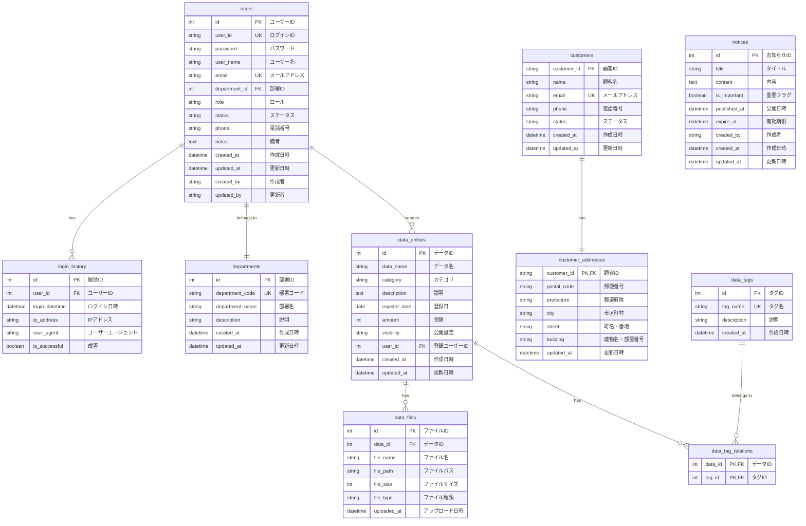

# データ定義書

## 1. 概要

本書は、Webシステムで使用するデータベースのテーブル定義について記載したものです。システムで扱うすべてのテーブルについて、その構造、制約、関連性を定義しています。

## 2. テーブル一覧

| テーブル物理名 | テーブル論理名 | 概要 |
|--------------|--------------|------|
| users | ユーザー | システムを利用するユーザー情報 |
| departments | 部署 | ユーザーが所属する部署情報 |
| customers | 顧客 | システムで管理する顧客情報 |
| customer_addresses | 顧客住所 | 顧客の住所情報 |
| data_entries | データエントリー | システムに登録されるデータ情報 |
| data_files | データファイル | データに添付されるファイル情報 |
| data_tags | データタグ | データの分類用タグ情報 |
| data_tag_relations | データタグ関連 | データとタグの関連付け |
| notices | お知らせ | システムからのお知らせ情報 |
| login_history | ログイン履歴 | ユーザーのログイン記録 |

## 3. ER図

## 4. テーブル定義

### 4.1 users（ユーザー）テーブル

#### テーブル概要
システムを利用するユーザー情報を管理するテーブル

#### カラム一覧

| カラム名 | データ型 | 桁数 | NULL許可 | 主キー | 外部キー | 初期値 | 説明 |
|---------|--------|------|----------|-------|---------|-------|------|
| id | INTEGER | - | NO | YES | - | AUTO_INCREMENT | ユーザーの内部ID |
| user_id | VARCHAR | 20 | NO | NO | - | - | ログインに使用するユーザーID |
| password | VARCHAR | 255 | NO | NO | - | - | ハッシュ化されたパスワード |
| user_name | VARCHAR | 50 | NO | NO | - | - | ユーザーのフルネーム |
| email | VARCHAR | 100 | NO | NO | - | - | メールアドレス |
| department_id | INTEGER | - | NO | NO | departments.id | - | 所属部署ID |
| role | VARCHAR | 20 | NO | NO | - | 'general' | 権限（admin/general） |
| status | VARCHAR | 10 | NO | NO | - | 'active' | アカウント状態（active/inactive） |
| phone | VARCHAR | 15 | YES | NO | - | NULL | 電話番号 |
| notes | TEXT | 500 | YES | NO | - | NULL | 備考欄 |
| created_at | DATETIME | - | NO | NO | - | CURRENT_TIMESTAMP | 作成日時 |
| updated_at | DATETIME | - | NO | NO | - | CURRENT_TIMESTAMP | 更新日時 |
| created_by | VARCHAR | 20 | YES | NO | - | NULL | 作成者のユーザーID |
| updated_by | VARCHAR | 20 | YES | NO | - | NULL | 更新者のユーザーID |

#### 制約事項

| 制約名 | 種類 | カラム | 参照先 | 説明 |
|--------|------|--------|--------|------|
| PK_users | PRIMARY KEY | id | - | ユーザーテーブルの主キー |
| UK_users_user_id | UNIQUE KEY | user_id | - | ユーザーIDの一意制約 |
| UK_users_email | UNIQUE KEY | email | - | メールアドレスの一意制約 |
| FK_users_department | FOREIGN KEY | department_id | departments.id | 部署テーブルとの外部キー制約 |

#### 備考
- パスワードは不可逆な暗号化ハッシュ（bcryptなど）で保存すること
- ロールは「admin（管理者）」と「general（一般ユーザー）」の2種類
- ステータスは「active（有効）」と「inactive（無効）」の2種類

### 4.2 departments（部署）テーブル

#### テーブル概要
ユーザーが所属する部署情報を管理するテーブル

#### カラム一覧

| カラム名 | データ型 | 桁数 | NULL許可 | 主キー | 外部キー | 初期値 | 説明 |
|---------|--------|------|----------|-------|---------|-------|------|
| id | INTEGER | - | NO | YES | - | AUTO_INCREMENT | 部署の内部ID |
| department_code | VARCHAR | 10 | NO | NO | - | - | 部署コード |
| department_name | VARCHAR | 50 | NO | NO | - | - | 部署名 |
| description | VARCHAR | 200 | YES | NO | - | NULL | 部署の説明 |
| created_at | DATETIME | - | NO | NO | - | CURRENT_TIMESTAMP | 作成日時 |
| updated_at | DATETIME | - | NO | NO | - | CURRENT_TIMESTAMP | 更新日時 |

#### 制約事項

| 制約名 | 種類 | カラム | 参照先 | 説明 |
|--------|------|--------|--------|------|
| PK_departments | PRIMARY KEY | id | - | 部署テーブルの主キー |
| UK_departments_code | UNIQUE KEY | department_code | - | 部署コードの一意制約 |

#### 備考
- マスターデータとして初期データを登録すること
- 部署の追加・変更・削除は管理者権限を持つユーザーのみ可能

### 4.3 customers（顧客）テーブル

#### テーブル概要
システムで管理する顧客情報を格納するテーブル

#### カラム一覧

| カラム名 | データ型 | 桁数 | NULL許可 | 主キー | 外部キー | 初期値 | 説明 |
|---------|--------|------|----------|-------|---------|-------|------|
| customer_id | VARCHAR | 20 | NO | YES | - | - | 顧客ID |
| name | VARCHAR | 100 | NO | NO | - | - | 顧客名 |
| email | VARCHAR | 256 | NO | NO | - | - | メールアドレス |
| phone | VARCHAR | 15 | YES | NO | - | NULL | 電話番号 |
| status | VARCHAR | 20 | NO | NO | - | 'active' | ステータス |
| created_at | DATETIME | - | NO | NO | - | CURRENT_TIMESTAMP | 作成日時 |
| updated_at | DATETIME | - | NO | NO | - | CURRENT_TIMESTAMP | 更新日時 |

#### 制約事項

| 制約名 | 種類 | カラム | 参照先 | 説明 |
|--------|------|--------|--------|------|
| PK_customers | PRIMARY KEY | customer_id | - | 顧客テーブルの主キー |
| UK_customers_email | UNIQUE KEY | email | - | メールアドレスの一意制約 |

#### 備考
- 顧客IDの形式は「CUS」で始まる8桁の英数字
- ステータスは「active（有効）」、「inactive（無効）」、「suspended（一時停止）」の3種類
- 住所情報は別テーブル（customer_addresses）で管理

### 4.4 customer_addresses（顧客住所）テーブル

#### テーブル概要
顧客の住所情報を管理するテーブル

#### カラム一覧

| カラム名 | データ型 | 桁数 | NULL許可 | 主キー | 外部キー | 初期値 | 説明 |
|---------|--------|------|----------|-------|---------|-------|------|
| customer_id | VARCHAR | 20 | NO | YES | customers.customer_id | - | 顧客ID |
| postal_code | VARCHAR | 8 | NO | NO | - | - | 郵便番号 |
| prefecture | VARCHAR | 10 | NO | NO | - | - | 都道府県 |
| city | VARCHAR | 50 | NO | NO | - | - | 市区町村 |
| street | VARCHAR | 100 | NO | NO | - | - | 町名・番地 |
| building | VARCHAR | 100 | YES | NO | - | NULL | 建物名・部屋番号 |
| updated_at | DATETIME | - | NO | NO | - | CURRENT_TIMESTAMP | 更新日時 |

#### 制約事項

| 制約名 | 種類 | カラム | 参照先 | 説明 |
|--------|------|--------|--------|------|
| PK_customer_addresses | PRIMARY KEY | customer_id | - | 住所テーブルの主キー |
| FK_address_customer | FOREIGN KEY | customer_id | customers.customer_id | 顧客テーブルとの外部キー制約 |

#### 備考
- 顧客テーブルとの1:1の関連を持つ
- 顧客テーブルのレコードが削除された場合、CASCADE削除される

### 4.5 data_entries（データエントリー）テーブル

#### テーブル概要
システムに登録されるデータ情報を管理するテーブル

#### カラム一覧

| カラム名 | データ型 | 桁数 | NULL許可 | 主キー | 外部キー | 初期値 | 説明 |
|---------|--------|------|----------|-------|---------|-------|------|
| id | INTEGER | - | NO | YES | - | AUTO_INCREMENT | データID |
| data_name | VARCHAR | 100 | NO | NO | - | - | データ名称 |
| category | VARCHAR | 50 | NO | NO | - | - | カテゴリ |
| description | TEXT | 1000 | YES | NO | - | NULL | 説明 |
| register_date | DATE | - | NO | NO | - | CURRENT_DATE | 登録日 |
| amount | INTEGER | 10 | NO | NO | - | 0 | 金額 |
| visibility | VARCHAR | 10 | NO | NO | - | 'private' | 公開設定（public/private） |
| user_id | INTEGER | - | NO | NO | users.id | - | 登録ユーザーID |
| created_at | DATETIME | - | NO | NO | - | CURRENT_TIMESTAMP | 作成日時 |
| updated_at | DATETIME | - | NO | NO | - | CURRENT_TIMESTAMP | 更新日時 |

#### 制約事項

| 制約名 | 種類 | カラム | 参照先 | 説明 |
|--------|------|--------|--------|------|
| PK_data_entries | PRIMARY KEY | id | - | データテーブルの主キー |
| FK_data_user | FOREIGN KEY | user_id | users.id | ユーザーテーブルとの外部キー制約 |
| CK_amount | CHECK | amount | - | 金額は0以上 |

#### 備考
- カテゴリはシステム内で定義された値のみを許可
- 公開設定は「public（公開）」と「private（非公開）」の2種類

### 4.6 data_files（データファイル）テーブル

#### テーブル概要
データに添付されるファイル情報を管理するテーブル

#### カラム一覧

| カラム名 | データ型 | 桁数 | NULL許可 | 主キー | 外部キー | 初期値 | 説明 |
|---------|--------|------|----------|-------|---------|-------|------|
| id | INTEGER | - | NO | YES | - | AUTO_INCREMENT | ファイルID |
| data_id | INTEGER | - | NO | NO | data_entries.id | - | 関連するデータID |
| file_name | VARCHAR | 255 | NO | NO | - | - | ファイル名 |
| file_path | VARCHAR | 500 | NO | NO | - | - | ファイルパス |
| file_size | INTEGER | - | NO | NO | - | - | ファイルサイズ（バイト） |
| file_type | VARCHAR | 50 | NO | NO | - | - | ファイルタイプ（MIME） |
| uploaded_at | DATETIME | - | NO | NO | - | CURRENT_TIMESTAMP | アップロード日時 |

#### 制約事項

| 制約名 | 種類 | カラム | 参照先 | 説明 |
|--------|------|--------|--------|------|
| PK_data_files | PRIMARY KEY | id | - | ファイルテーブルの主キー |
| FK_file_data | FOREIGN KEY | data_id | data_entries.id | データテーブルとの外部キー制約（CASCADE） |

#### 備考
- 実際のファイルはストレージに保存し、このテーブルには参照情報のみ格納
- 許可されるファイル形式は、pdf, jpg, png のみ
- 1つのデータエントリーに複数のファイルを添付可能

### 4.7 data_tags（データタグ）テーブル

#### テーブル概要
データの分類用タグ情報を管理するテーブル

#### カラム一覧

| カラム名 | データ型 | 桁数 | NULL許可 | 主キー | 外部キー | 初期値 | 説明 |
|---------|--------|------|----------|-------|---------|-------|------|
| id | INTEGER | - | NO | YES | - | AUTO_INCREMENT | タグID |
| tag_name | VARCHAR | 50 | NO | NO | - | - | タグ名 |
| description | VARCHAR | 200 | YES | NO | - | NULL | タグの説明 |
| created_at | DATETIME | - | NO | NO | - | CURRENT_TIMESTAMP | 作成日時 |

#### 制約事項

| 制約名 | 種類 | カラム | 参照先 | 説明 |
|--------|------|--------|--------|------|
| PK_data_tags | PRIMARY KEY | id | - | タグテーブルの主キー |
| UK_data_tags_name | UNIQUE KEY | tag_name | - | タグ名の一意制約 |

#### 備考
- マスターデータとして初期データを登録すること
- タグの追加は管理者権限を持つユーザーのみ可能

### 4.8 data_tag_relations（データタグ関連）テーブル

#### テーブル概要
データとタグの関連付けを管理する中間テーブル

#### カラム一覧

| カラム名 | データ型 | 桁数 | NULL許可 | 主キー | 外部キー | 初期値 | 説明 |
|---------|--------|------|----------|-------|---------|-------|------|
| data_id | INTEGER | - | NO | YES | data_entries.id | - | データID |
| tag_id | INTEGER | - | NO | YES | data_tags.id | - | タグID |

#### 制約事項

| 制約名 | 種類 | カラム | 参照先 | 説明 |
|--------|------|--------|--------|------|
| PK_data_tag_relations | PRIMARY KEY | (data_id, tag_id) | - | データタグ関連テーブルの複合主キー |
| FK_relation_data | FOREIGN KEY | data_id | data_entries.id | データテーブルとの外部キー制約（CASCADE） |
| FK_relation_tag | FOREIGN KEY | tag_id | data_tags.id | タグテーブルとの外部キー制約（CASCADE） |

#### 備考
- データとタグのM:N関係を実現するための中間テーブル
- 1つのデータに複数のタグ、1つのタグに複数のデータを関連付け可能

### 4.9 notices（お知らせ）テーブル

#### テーブル概要
システムからのお知らせ情報を管理するテーブル

#### カラム一覧

| カラム名 | データ型 | 桁数 | NULL許可 | 主キー | 外部キー | 初期値 | 説明 |
|---------|--------|------|----------|-------|---------|-------|------|
| id | INTEGER | - | NO | YES | - | AUTO_INCREMENT | お知らせID |
| title | VARCHAR | 100 | NO | NO | - | - | タイトル |
| content | TEXT | - | NO | NO | - | - | 内容 |
| is_important | BOOLEAN | - | NO | NO | - | FALSE | 重要フラグ |
| published_at | DATETIME | - | NO | NO | - | CURRENT_TIMESTAMP | 公開日時 |
| expire_at | DATETIME | - | YES | NO | - | NULL | 有効期限 |
| created_by | VARCHAR | 20 | NO | NO | - | - | 作成者のユーザーID |
| created_at | DATETIME | - | NO | NO | - | CURRENT_TIMESTAMP | 作成日時 |
| updated_at | DATETIME | - | NO | NO | - | CURRENT_TIMESTAMP | 更新日時 |

#### 制約事項

| 制約名 | 種類 | カラム | 参照先 | 説明 |
|--------|------|--------|--------|------|
| PK_notices | PRIMARY KEY | id | - | お知らせテーブルの主キー |

#### 備考
- 重要なお知らせは重要フラグをTRUEにして強調表示
- 有効期限が過ぎたお知らせは表示されない
- 有効期限がNULLの場合は無期限で表示される

### 4.10 login_history（ログイン履歴）テーブル

#### テーブル概要
ユーザーのログイン記録を管理するテーブル

#### カラム一覧

| カラム名 | データ型 | 桁数 | NULL許可 | 主キー | 外部キー | 初期値 | 説明 |
|---------|--------|------|----------|-------|---------|-------|------|
| id | INTEGER | - | NO | YES | - | AUTO_INCREMENT | 履歴ID |
| user_id | INTEGER | - | NO | NO | users.id | - | ユーザーID |
| login_datetime | DATETIME | - | NO | NO | - | CURRENT_TIMESTAMP | ログイン日時 |
| ip_address | VARCHAR | 45 | NO | NO | - | - | IPアドレス |
| user_agent | VARCHAR | 500 | YES | NO | - | NULL | ユーザーエージェント |
| is_successful | BOOLEAN | - | NO | NO | - | TRUE | ログイン成否 |

#### 制約事項

| 制約名 | 種類 | カラム | 参照先 | 説明 |
|--------|------|--------|--------|------|
| PK_login_history | PRIMARY KEY | id | - | ログイン履歴テーブルの主キー |
| FK_login_user | FOREIGN KEY | user_id | users.id | ユーザーテーブルとの外部キー制約 |

#### 備考
- ログイン試行の成功・失敗にかかわらず記録
- セキュリティ監査や不正アクセス検知に使用
- IPアドレスはIPv6対応のため45桁まで許容

## 5. インデックス定義

| テーブル名 | インデックス名 | カラム | 種類 | 説明 |
|-----------|--------------|-------|------|------|
| users | IDX_users_email | email | BTREE | メールアドレス検索向上のため |
| users | IDX_users_status | status | BTREE | アカウント状態でのフィルタリング向上のため |
| customers | IDX_customers_name | name | BTREE | 顧客名検索向上のため |
| customers | IDX_customers_status | status | BTREE | 顧客状態でのフィルタリング向上のため |
| data_entries | IDX_data_category | category | BTREE | カテゴリでのフィルタリング向上のため |
| data_entries | IDX_data_register_date | register_date | BTREE | 登録日での検索向上のため |
| data_entries | IDX_data_visibility | visibility | BTREE | 公開設定でのフィルタリング向上のため |
| login_history | IDX_login_datetime | login_datetime | BTREE | ログイン日時範囲検索向上のため |
| notices | IDX_notices_published | published_at | BTREE | 公開日での検索向上のため |
| notices | IDX_notices_expire | expire_at | BTREE | 有効期限での検索向上のため |

## 6. 参照整合性制約

| 制約名 | 主テーブル | 主キー | 外部テーブル | 外部キー | オンデリート | オンアップデート |
|--------|----------|--------|------------|---------|------------|---------------|
| FK_users_department | departments | id | users | department_id | RESTRICT | CASCADE |
| FK_address_customer | customers | customer_id | customer_addresses | customer_id | CASCADE | CASCADE |
| FK_data_user | users | id | data_entries | user_id | RESTRICT | CASCADE |
| FK_file_data | data_entries | id | data_files | data_id | CASCADE | CASCADE |
| FK_relation_data | data_entries | id | data_tag_relations | data_id | CASCADE | CASCADE |
| FK_relation_tag | data_tags | id | data_tag_relations | tag_id | CASCADE | CASCADE |
| FK_login_user | users | id | login_history | user_id | CASCADE | CASCADE |

## 7. パーティション定義

以下のテーブルについてはパーティションを検討する：

1. **login_history テーブル**
   - パーティションキー: login_datetime
   - パーティションタイプ: RANGE BY MONTH
   - 保持期間: 12か月（古いパーティションは定期的に削除）

2. **notices テーブル**
   - パーティションキー: published_at
   - パーティションタイプ: RANGE BY QUARTER
   - 保持期間: 適宜判断

## 8. データ容量見積

| テーブル名 | 1レコードサイズ | 想定レコード数 | 合計サイズ | 備考 |
|-----------|--------------|------------|----------|------|
| users | 約1KB | 1,000件 | 約1MB | 組織規模による |
| departments | 約0.5KB | 50件 | 約0.025MB | 組織構造による |
| customers | 約0.8KB | 10,000件 | 約8MB | 顧客数による |
| customer_addresses | 約0.6KB | 10,000件 | 約6MB | 顧客と1:1 |
| data_entries | 約1.2KB | 100,000件 | 約120MB | 年間登録数×保持年数 |
| data_files | 約0.8KB | 50,000件 | 約40MB | ファイル自体のサイズは含まない |
| data_tags | 約0.3KB | 100件 | 約0.03MB | - |
| data_tag_relations | 約0.1KB | 200,000件 | 約20MB | データとタグの関連付け数 |
| notices | 約2KB | 1,000件 | 約2MB | お知らせ保持期間による |
| login_history | 約0.5KB | 500,000件 | 約250MB | アクセス頻度×ユーザー数×保持期間 |

**合計データベースサイズ見積り**: 約447MB（実データのみ、インデックスやオーバーヘッドを除く）

## 9. 備考

- 本データ定義書は初版であり、今後の要件変更により変更される可能性がある
- パフォーマンス要件に応じて、インデックスやパーティションの調整が必要
- 個人情報を含むデータについては、適切なセキュリティ対策（暗号化など）を行うこと
- データバックアップは日次で実施し、30日間保持すること
- トランザクションログは1時間ごとに取得し、7日間保持すること