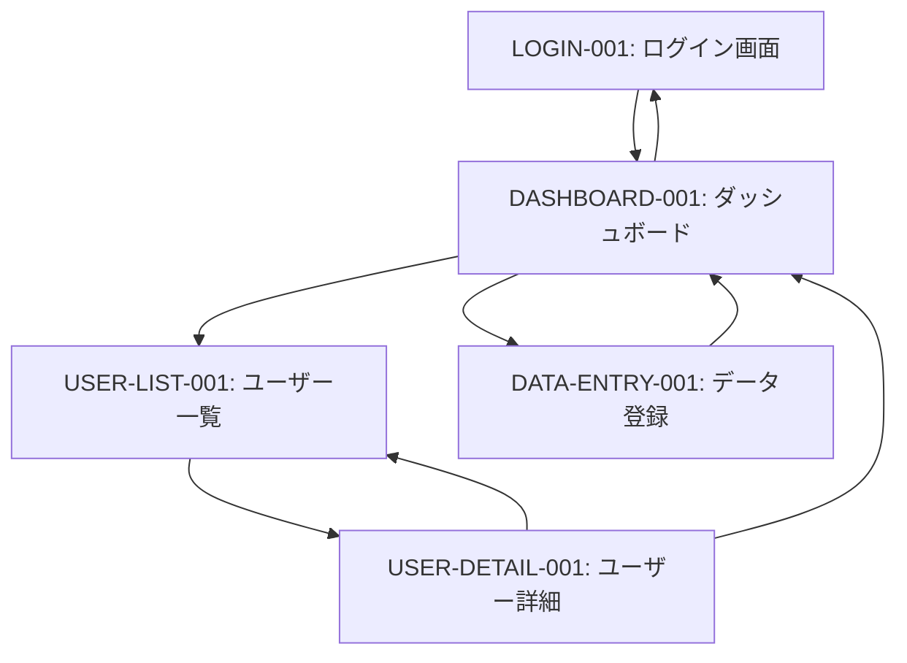
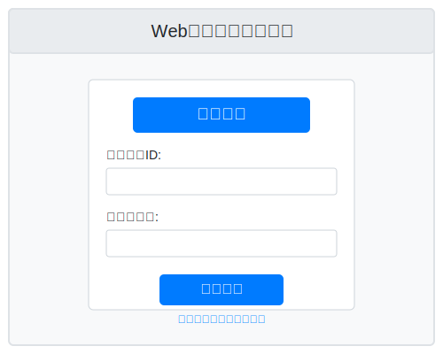
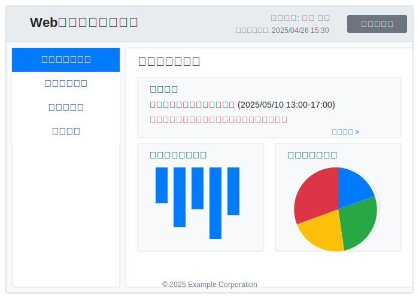
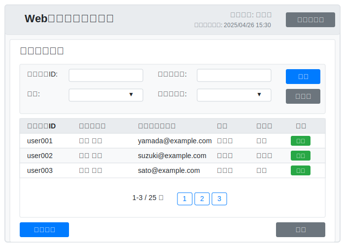
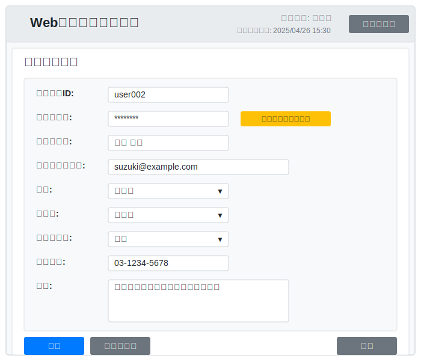
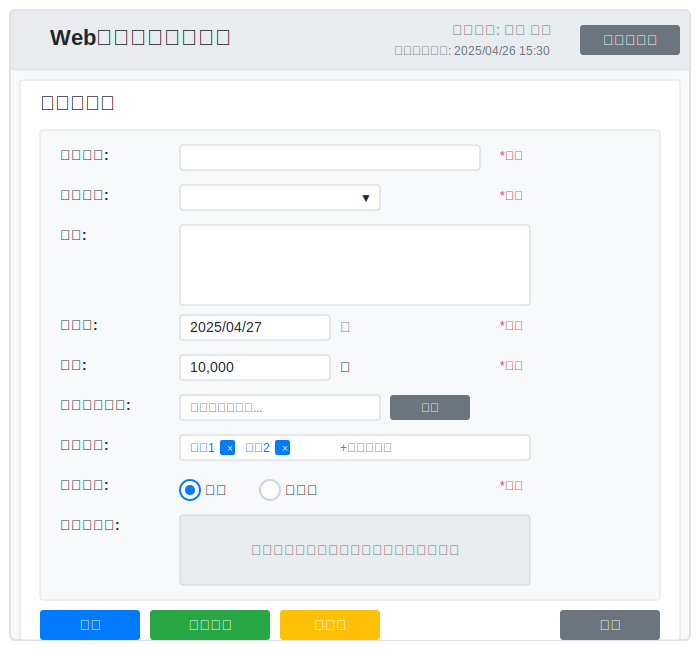

# Webアプリケーション画面設計書

## 基本情報

| 項目 | 内容 |
|------|------|
| 文書名 | Webアプリケーション画面設計書 |
| 作成日 | 2025年4月27日 |
| バージョン | 0.1.0 |
| 作成者 | 開発チーム |

## 目次

1. [画面一覧](#画面一覧)
2. [画面遷移図](#画面遷移図)
3. [画面詳細](#画面詳細)
   1. [ログイン画面](#login-001)
   2. [ダッシュボード画面](#dashboard-001)
   3. [ユーザー一覧画面](#user-list-001)
   4. [ユーザー詳細画面](#user-detail-001)
   5. [データ登録画面](#data-entry-001)

## 画面一覧 

| 画面ID | 画面名 | 概要 |
|--------|--------|------|
| LOGIN-001 | ログイン画面 | システムへのログインを行う画面 |
| DASHBOARD-001 | ダッシュボード画面 | システムのメイン画面、各機能へのアクセスポイント |
| USER-LIST-001 | ユーザー一覧画面 | システム利用者の一覧を表示する画面 |
| USER-DETAIL-001 | ユーザー詳細画面 | ユーザーの詳細情報を表示・編集する画面 |
| DATA-ENTRY-001 | データ登録画面 | 新規データを登録するための画面 |

## 画面遷移図 

## 画面詳細 

### ログイン画面 

| 項目 | 内容 |
|------|------|
| **画面ID** | LOGIN-001 |
| **画面名** | ログイン画面 |
| **画面概要** | システムへのログイン認証を行うための画面 |
| **画面遷移** | 遷移元: なし 遷移先: ダッシュボード画面 |
| **利用ユーザー** | 全ユーザー |

#### 主な機能
- ユーザー認証
- パスワードリセット申請

#### 入力項目一覧

| 項目名 | 型 | 桁数 | 必須/任意 | バリデーションルール |
|--------|-----|------|-----------|---------------------|
| ユーザーID | 文字列 | 8〜20桁 | 必須 | 半角英数字のみ許可 |
| パスワード | 文字列 | 8〜20桁 | 必須 | 半角英数字記号を含む |

#### ボタン・リンク一覧

| 名称 | 機能 | 遷移先 |
|------|------|--------|
| ログイン | 入力された認証情報でログイン処理を実行 | ダッシュボード画面 |
| パスワードを忘れた場合 | パスワードリセット機能へ誘導 | パスワードリセット画面 |

#### エラーメッセージ一覧

| エラーID | 表示内容 | 発生条件 |
|---------|---------|---------|
| E001 | ユーザーIDまたはパスワードが間違っています | 認証失敗時 |
| E002 | ユーザーIDは必須項目です | ユーザーID未入力時 |
| E003 | パスワードは必須項目です | パスワード未入力時 |
| E004 | 5回連続でログインに失敗しました。 30分後に再度お試しください。 | 連続ログイン失敗時 |

#### 画面レイアウト

### ダッシュボード画面 

| 項目 | 内容 |
|------|------|
| **画面ID** | DASHBOARD-001 |
| **画面名** | ダッシュボード画面 |
| **画面概要** | システムのメイン画面、重要情報の概要と各機能へのナビゲーション |
| **画面遷移** | 遷移元: ログイン画面 遷移先: ユーザー一覧画面、データ登録画面 |
| **利用ユーザー** | 認証済みユーザー（全ロール） |

#### 主な機能
- システムステータスの表示
- グラフによるデータ分析表示
- 各機能へのナビゲーション
- 最新のお知らせ表示

#### 表示項目一覧

| 項目名 | 説明 |
|--------|------|
| ユーザー名 | ログインユーザーの名前 |
| 最終ログイン | 前回のログイン日時 |
| お知らせ | システムからの最新のお知らせ（5件まで表示） |
| データ概要 | 登録データの集計情報 |
| ステータスグラフ | 各種ステータスの可視化グラフ |

#### ボタン・リンク一覧

| 名称 | 機能 | 遷移先 |
|------|------|--------|
| ユーザー管理 | ユーザー一覧画面へ遷移 | ユーザー一覧画面 |
| データ登録 | データ登録画面へ遷移 | データ登録画面 |
| ログアウト | システムからログアウト | ログイン画面 |
| お知らせ全件 | お知らせの全件表示 | お知らせ一覧画面 |

#### 備考
- ユーザーの権限によって表示されるメニューが異なる
- 重要なお知らせは赤色で強調表示される
- データは24時間ごとに更新される

#### 画面レイアウト

### ユーザー一覧画面 

| 項目 | 内容 |
|------|------|
| **画面ID** | USER-LIST-001 |
| **画面名** | ユーザー一覧画面 |
| **画面概要** | システム利用者の一覧を表示・検索・編集するための画面 |
| **画面遷移** | 遷移元: ダッシュボード画面 遷移先: ユーザー詳細画面、ダッシュボード画面 |
| **利用ユーザー** | 管理者ロール |

#### 主な機能
- ユーザー情報の一覧表示
- ユーザー検索
- ユーザー新規登録
- ユーザー情報の編集・削除

#### 入力項目一覧（検索条件）

| 項目名 | 型 | 桁数 | 必須/任意 | バリデーションルール |
|--------|-----|------|-----------|---------------------|
| ユーザーID | 文字列 | 20桁まで | 任意 | 半角英数字 |
| ユーザー名 | 文字列 | 50桁まで | 任意 | なし |
| 部署 | リスト | - | 任意 | 予め定義された部署リストから選択 |
| ステータス | リスト | - | 任意 | 有効/無効から選択 |

#### 表示項目一覧（検索結果）

| 項目名 | 説明 |
|--------|------|
| ユーザーID | システム内のユーザー識別子 |
| ユーザー名 | ユーザーのフルネーム |
| メールアドレス | ユーザーの連絡先メールアドレス |
| 部署 | ユーザーの所属部署 |
| ロール | システム内の権限（管理者/一般ユーザー等） |
| ステータス | アカウントの状態（有効/無効） |
| 最終ログイン | 最後にログインした日時 |

#### ボタン・リンク一覧

| 名称 | 機能 | 遷移先 |
|------|------|--------|
| 検索 | 入力条件に基づきユーザーを検索 | 同画面（結果更新） |
| クリア | 検索条件をリセット | 同画面（条件クリア） |
| 新規登録 | 新規ユーザー登録フォームを表示 | ユーザー詳細画面（新規モード） |
| 編集 | 選択したユーザー情報の編集 | ユーザー詳細画面（編集モード） |
| 削除 | 選択したユーザーの削除 | 同画面（確認ダイアログ表示後） |
| 戻る | ダッシュボードへ戻る | ダッシュボード画面 |

#### エラーメッセージ一覧

| エラーID | 表示内容 | 発生条件 |
|---------|---------|---------|
| E101 | 検索結果が1000件を超えています。 検索条件を絞り込んでください。 | 検索結果過多時 |
| E102 | 削除対象ユーザーが見つかりません | 既に削除されているユーザーを削除しようとした場合 |
| E103 | 自分自身のアカウントは削除できません | ログインユーザーのアカウントを削除しようとした場合 |

#### 画面レイアウト

### ユーザー詳細画面 

| 項目 | 内容 |
|------|------|
| **画面ID** | USER-DETAIL-001 |
| **画面名** | ユーザー詳細画面 |
| **画面概要** | ユーザーの詳細情報の閲覧・編集を行う画面 |
| **画面遷移** | 遷移元: ユーザー一覧画面 遷移先: ユーザー一覧画面、ダッシュボード画面 |
| **利用ユーザー** | 管理者ロール |

#### 主な機能
- ユーザー情報の詳細表示
- ユーザー情報の編集
- ユーザーパスワードのリセット

#### 入力項目一覧

| 項目名 | 型 | 桁数 | 必須/任意 | バリデーションルール |
|--------|-----|------|-----------|---------------------|
| ユーザーID | 文字列 | 8〜20桁 | 必須 | 半角英数字、既存IDと重複不可 |
| パスワード | 文字列 | 8〜20桁 | 新規時必須 | 英大文字・小文字・数字・記号をそれぞれ1文字以上含む |
| ユーザー名 | 文字列 | 50桁まで | 必須 | なし |
| メールアドレス | 文字列 | 100桁まで | 必須 | メールアドレス形式であること |
| 部署 | リスト | - | 必須 | 予め定義された部署リストから選択 |
| ロール | リスト | - | 必須 | 管理者/一般ユーザーから選択 |
| ステータス | リスト | - | 必須 | 有効/無効から選択 |
| 電話番号 | 文字列 | 15桁まで | 任意 | 数字とハイフンのみ許可 |
| 備考 | テキストエリア | 500桁まで | 任意 | なし |

#### ボタン・リンク一覧

| 名称 | 機能 | 遷移先 |
|------|------|--------|
| 保存 | 入力情報を保存 | ユーザー一覧画面 |
| キャンセル | 編集をキャンセル | ユーザー一覧画面 |
| パスワードリセット | ユーザーのパスワードを初期化 | 同画面（確認ダイアログ表示後） |
| 戻る | 一覧画面へ戻る | ユーザー一覧画面 |

#### エラーメッセージ一覧

| エラーID | 表示内容 | 発生条件 |
|---------|---------|---------|
| E201 | 入力されたユーザーIDは既に使用されています | ID重複時 |
| E202 | パスワードは英大文字・小文字・数字・記号をそれぞれ1文字以上含む必要があります | パスワード要件不足時 |
| E203 | 入力されたメールアドレスの形式が正しくありません | メールアドレス形式不正時 |
| E204 | 必須項目が入力されていません | 必須項目未入力時 |

#### 画面レイアウト

### データ登録画面 

| 項目 | 内容 |
|------|------|
| **画面ID** | DATA-ENTRY-001 |
| **画面名** | データ登録画面 |
| **画面概要** | システムに新規データを登録するための画面 |
| **画面遷移** | 遷移元: ダッシュボード画面 遷移先: ダッシュボード画面 |
| **利用ユーザー** | 一般ユーザーロール以上 |

#### 主な機能
- データ入力フォーム
- 入力バリデーション
- ファイルアップロード

#### 入力項目一覧

| 項目名 | 型 | 桁数 | 必須/任意 | バリデーションルール |
|--------|-----|------|-----------|---------------------|
| データ名 | 文字列 | 100桁まで | 必須 | なし |
| カテゴリ | リスト | - | 必須 | 予め定義されたカテゴリから選択 |
| 説明 | テキストエリア | 1000桁まで | 任意 | なし |
| 登録日 | 日付 | - | 必須 | 本日以前の日付 |
| 金額 | 数値 | 10桁まで | 必須 | 0以上の整数 |
| 添付ファイル | ファイル | - | 任意 | 最大5MBまで、許可拡張子：pdf, jpg, png |
| 関連タグ | 複数選択 | - | 任意 | 予め定義されたタグから複数選択可 |
| 公開設定 | ラジオ | - | 必須 | 公開/非公開から選択 |

#### ボタン・リンク一覧

| 名称 | 機能 | 遷移先 |
|------|------|--------|
| 登録 | データを登録 | ダッシュボード画面（成功時） |
| 一時保存 | 入力内容を一時保存 | 同画面（保存成功メッセージ表示） |
| クリア | 入力内容をリセット | 同画面（確認ダイアログ表示後） |
| 戻る | 入力をキャンセルして戻る | ダッシュボード画面（確認ダイアログ表示後） |

#### エラーメッセージ一覧

| エラーID | 表示内容 | 発生条件 |
|---------|---------|---------|
| E301 | データ名は必須項目です | データ名未入力時 |
| E302 | 登録日は本日以前の日付を入力してください | 未来の日付入力時 |
| E303 | 金額は0以上の整数で入力してください | 金額の形式不正時 |
| E304 | ファイルサイズは5MBまでです | ファイルサイズ超過時 |
| E305 | 許可されていないファイル形式です | 非対応拡張子のファイル添付時 |
| E306 | アップロード中にエラーが発生しました | ファイルアップロード失敗時 |

#### 備考
- 一時保存されたデータは7日間保持される
- 登録完了時にはデータ登録番号が自動発番され、画面表示される
- 添付ファイルはクライアント側でプレビュー可能

#### 画面レイアウト

